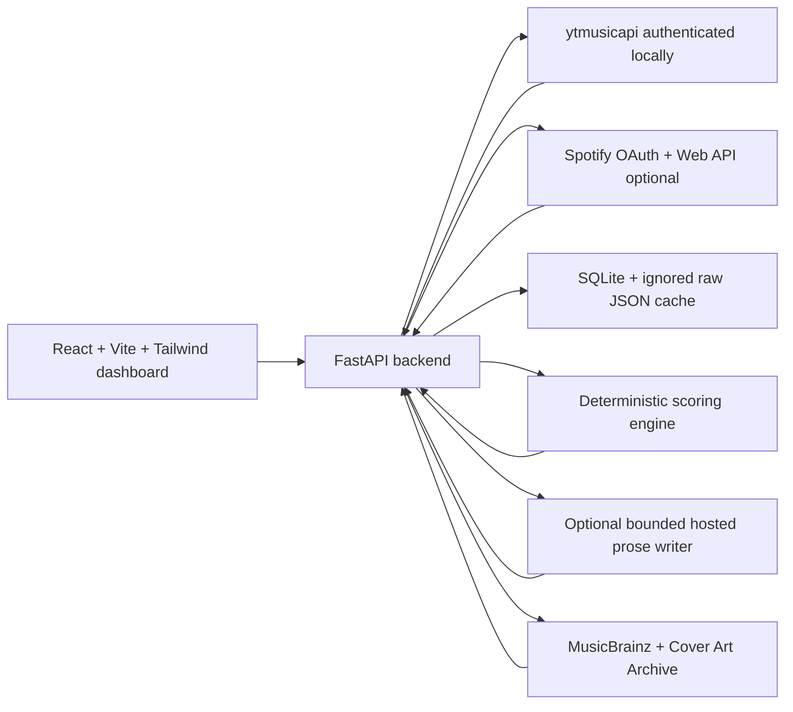

# Saville Music Persona Web

This repository is the anonymous hosted edition of Saville Music Persona. Visitors do not create an account or connect a music service: they upload a Google Takeout or Spotify extended streaming-history export, explore the generated dashboard, and can delete the session immediately. The original desktop/local edition remains in [Saville-Music-Persona](https://github.com/aidanchan0623/Saville-Music-Persona) at the `local-v1.0` tag.

The deterministic analytics path needs no paid LLM API. Phase 4 adds an optional bounded server-side report writer; when it is disabled, busy, rate-limited, invalid, or timed out, the complete deterministic report remains available.

## Screenshots

Screenshots are intentionally left out until you run the app against your own private data. The dashboard includes:

- Lightweight Overview hero with timeframe controls, Most Active Sound, analysis coverage, and one Persona Report entry point
- Detected Listening Time overview
- Monthly and rolling-year Top 10 songs and artists
- Consolidated Insights dashboard for listening profile, scores, rhythm and rankings
- Music-family radar profile with explicit genre-classification coverage
- Compact listening score gauges with transparent formulas
- Weekly/monthly detected-minutes rhythm toggle
- Top artists, repeated songs and recent daily intensity
- Cinematic five-chapter Persona Report controlled by natural scrolling
- Deterministic Music Character classification from the canonical personality registry
- Period-specific detected listening time, genre shares, and Top 5 rankings
- Deterministic Musical Age with its rolling-year source period shown explicitly
- Optional hosted-writer descriptions and final roast with complete deterministic fallbacks
- One persistent decorative album-dome background built from real ranked album covers
- Evidence-driven recommendations
- Connect YouTube Music settings page
- Spotify source switcher with optional OAuth and direct extended streaming-history ZIP/JSON import

## Architecture



The Takeout integrity path is deliberately separate from presentation:

```mermaid
flowchart LR
  ZIP["Takeout ZIP / watch history"] --> Parser["Schema-v5 parser + record outcomes"]
  Parser --> Events["Schema-v4 canonical listening events"]
  Events --> Source["Exact source-video identity"]
  Source --> Metadata["Resumable track / album / release-year metadata cache"]
  Metadata --> Recording["Version-aware canonical recording identity"]
  Recording --> Period["Analytics-v5 timezone and period filter"]
  Period --> Pages["Overview / Top 10 / Insights / Persona Report"]
```



Raw title, channel, source URL, timestamp, and source-video provenance are retained. Only overlapping copies with the same source occurrence fingerprint are deduplicated; repeated plays at different timestamps remain separate events. Presentation labels such as Official Audio, Official Video, Lyrics, and Visualizer may share a canonical recording, while live, remix, remaster, slowed, sped-up, instrumental, acoustic, radio-edit, and cover versions remain distinct.

## Local prerequisites

- Windows PowerShell
- Python 3.11 or newer
- Node.js 20 or newer
- npm
- Git
- Ollama
- Ollama model `gemma3:4b`

## Setup on Windows

From the repository root:

```powershell
powershell -ExecutionPolicy Bypass -File .\scripts\setup_windows.ps1
```

The setup script checks prerequisites, creates `backend\.venv`, installs backend/frontend dependencies, verifies Ollama, and pulls:

```powershell
ollama pull gemma3:4b
```

If Ollama is missing and `winget` is available, the script prints:

```powershell
winget install Ollama.Ollama
```

## YouTube Music authentication

Read [docs/AUTH_SETUP.md](docs/AUTH_SETUP.md).

Short version:

```powershell
New-Item -ItemType Directory -Force .\backend\private
$env:YTMUSIC_OAUTH_CLIENT_ID="your-client-id"
$env:YTMUSIC_OAUTH_CLIENT_SECRET="your-client-secret"
$env:YTMUSIC_AUTH_FILE="backend/private/oauth.json"
```

Then generate `backend/private/oauth.json` using the `ytmusicapi oauth` flow from the virtual environment. Keep that file private.

## Optional Spotify authentication

YouTube Music remains the default source. Spotify is optional and stored separately, so disconnecting Spotify does not delete or overwrite YouTube Music or Google Takeout data.

1. Create an app in the [Spotify Developer Dashboard](https://developer.spotify.com/dashboard).
2. Add this redirect URI to the Spotify app:

```text
http://localhost:8000/api/spotify/callback
```

3. Put credentials in `backend/private/.env` or your local shell, never in Git:

```powershell
SPOTIFY_CLIENT_ID=your-spotify-client-id
SPOTIFY_CLIENT_SECRET=your-spotify-client-secret
SPOTIFY_REDIRECT_URI=http://localhost:8000/api/spotify/callback
```

4. Run the backend and frontend, open Settings, and click Connect Spotify.
5. If your Spotify app is in Development Mode, add each friend/account as an allow-listed user in the Spotify dashboard.

Spotify OAuth data uses top tracks, top artists, saved songs, playlists, and recent plays. For complete dated history, request **Extended streaming history** from Spotify's account privacy page and upload the downloaded ZIP directly in Settings. Saville keeps each genuine play event, removes only exact duplicate copies from overlapping export files, ignores podcast/audiobook rows, and uses Spotify's `ms_played` value for listening minutes. OAuth remains optional, but connecting it can enrich imported history with catalogue images, albums, release dates, and artist genres.

## Run the app

```powershell
powershell -ExecutionPolicy Bypass -File .\scripts\run_dev.ps1
```

Default URLs:

- Frontend: `http://localhost:5173`
- Backend: `http://localhost:8000`

## Anonymous hosted mode (Phases 1-5)

Set `SMP_DEPLOYMENT_MODE=anonymous` before the backend starts to switch from the single-user desktop runtime to cookie-isolated upload sessions. The browser first calls `/api/session`; the backend issues an opaque HTTP-only cookie, and all listening profiles, analytics, reports, and background-job state are transparently stored under that session namespace. Reusable public music metadata caches remain shared, but one visitor cannot read another visitor's listening profile. Canonical listening-event index keys are session-scoped as well, so two people may import the same event without a database collision.

The Web repository defaults to `anonymous` if the variable is omitted, so a hosted process cannot accidentally expose local account-connection routes. For plain-HTTP development, explicitly use `SMP_SESSION_COOKIE_SECURE=false`; use the separate desktop repository for the complete local/Ollama experience.

Anonymous mode disables YouTube Music and Spotify account connections, playlist writes, local credential discovery, and calls to the developer's local Ollama service. Visitors use Google Takeout or Spotify extended streaming-history uploads instead.

Phase 2 adds a bounded lifecycle:

- Session expiry is absolute; refreshing the page does not silently renew it.
- Expired cache rows and their derived listening-event index are purged automatically.
- Temporary upload files are removed after processing, with stale-file cleanup as a fallback.
- Visitors can delete their own session immediately from Settings.
- Public metadata about songs/artists may remain shared, but listening events, reports, rankings, and uploads do not.
- Upload size, event count, hourly upload frequency, and process-wide concurrent imports are capped.
- Rate limits are keyed only by the opaque session cookie; the app does not create user accounts or an analytics identity.

Example hosted environment:

```text
SMP_DEPLOYMENT_MODE=anonymous
SMP_SESSION_COOKIE_SECURE=true
SMP_SESSION_COOKIE_SAMESITE=none
SMP_SESSION_TTL_HOURS=24
SMP_SESSION_CLEANUP_INTERVAL_SECONDS=300
SMP_ANONYMOUS_MAX_UPLOAD_BYTES=536870912
SMP_TAKEOUT_MAX_UPLOAD_BYTES=536870912
SMP_TAKEOUT_IMPORT_TIMEOUT_SECONDS=1200
SMP_ANONYMOUS_MAX_EVENTS=250000
SMP_ANONYMOUS_UPLOADS_PER_HOUR=4
SMP_ANONYMOUS_MAX_CONCURRENT_IMPORTS=1
SMP_ALLOWED_HOSTS=your-app.example
SMP_OPERATIONS_TOKEN=generate-a-long-random-secret
SMP_CORS_ORIGINS=https://your-frontend.example
SMP_FRONTEND_URL=https://your-frontend.example
```

Use `SMP_SESSION_COOKIE_SECURE=false` only for plain-HTTP localhost testing. When frontend and API use different sites, set `SMP_SESSION_COOKIE_SAMESITE=none`, configure the exact frontend origin rather than `*`, and keep credentialed requests enabled.

## Phase 3 production runtime

The Web repository now builds as one production container that serves the React dashboard and FastAPI from the same origin. SQLite uses WAL mode on a configurable persistent volume, readiness checks verify storage and frontend availability, and the hosted launcher enforces exactly one application process so in-process import workers cannot race across replicas. GitHub Actions tests the complete project, smoke-tests the image, and publishes successful `main` images to GitHub Container Registry.

```powershell
docker compose up --build
```

Open `http://localhost:8000` for a local production-container test. See [Hosted deployment](docs/HOSTED_DEPLOYMENT.md) for volume, HTTPS, health-check, privacy, and free-hosting trade-offs.

Phases 1-3 establish isolation, deletion, expiry, resource controls, and a deployable single-instance runtime. Phase 4 adds automatic shared-catalogue enrichment, a bounded hosted report-writer adapter, asynchronous progress, and deterministic fallbacks. Phase 5 adds privacy-preserving operator counters, host and browser security boundaries, mobile/tablet/desktop acceptance tests, and a deployment preflight that verifies deletion before a friend-group launch.

## Phase 4 metadata and report adapters

After a YouTube Takeout or Spotify history import, the web client automatically runs the conservative metadata hierarchy: uploaded provider metadata, reusable exact-match cache, MusicBrainz artist evidence, exact MusicBrainz recording evidence, and Cover Art Archive artwork. Weak title-and-artist-only matches are never written as permanent provider identifiers or reusable artwork records. Version markers and confidence components remain part of the identity gate.

Persona Report generation now runs as a bounded background job with visible progress. A server-only OpenAI-compatible provider may rewrite six prose fields from compact deterministic evidence; it never decides rankings, counts, genres, Musical Age, or personality. The API key is never sent to the browser. Per-session and global request budgets, provider timeout, output cap, concurrent-job cap, strict JSON validation, and a deterministic fallback prevent remote prose from blocking the product.

See [Hosted deployment](docs/HOSTED_DEPLOYMENT.md#phase-4-optional-hosted-report-writer) for configuration and privacy details.

## Phase 5 launch readiness

The hosted build remains intentionally anonymous and single-instance. `/api/ops/status` is disabled unless `SMP_OPERATIONS_TOKEN` is configured; with the matching `X-Saville-Ops-Token` header it returns uptime, database size, active/expired session counts, capacity limits, and aggregate lifecycle counters. It cannot return session identifiers, network identifiers, filenames, tracks, artists, reports, or listening history.

Every API response is non-cacheable, browser security headers are applied to the frontend and API, production hosts can be restricted with `SMP_ALLOWED_HOSTS`, and HTTPS responses enable HSTS. CI now launches the complete hosted application and tests anonymous importing controls at mobile, tablet, and desktop sizes. Before sharing a deployment, run:

```powershell
python scripts/hosted_preflight.py https://your-app.example --operations-token $env:SMP_OPERATIONS_TOKEN
```

The preflight creates an empty anonymous session, confirms account routes are disabled, checks cookie and security policy behavior, and deletes that session. It never uploads music data. Complete [the launch checklist](docs/LAUNCH_CHECKLIST.md) before inviting testers.

## Development commands

```powershell
npm.cmd --prefix frontend run dev
npm.cmd --prefix frontend run build
npm.cmd --prefix frontend run lint
backend\.venv\Scripts\python.exe -m pytest backend\tests
backend\.venv\Scripts\python.exe -m uvicorn app.main:app --app-dir backend --reload --host 127.0.0.1 --port 8000
```

## Detected listening minutes

Saville Music Persona never claims to know exact listening time.

**Detected listening minutes** means the sum of full track durations for listening events recorded in the local merged history dataset.

The app can know that a track appeared in local history data, but it cannot reliably know whether you listened to every second, skipped early, replayed only part of it, or left playback running in the background. Minutes are therefore shown as an estimate from detected track durations.

Rules:

- Events with no trustworthy duration stay in play-count analysis but are excluded from minute totals.
- Obvious podcasts, interviews, livestreams, playlists, very long videos, and other longform/non-music entries are marked with an exclusion reason.
- Duration coverage is shown beside minute-based stats.
- The duration cache is stored locally so successful YouTube Music duration lookups are reused.
- Confidence badges are based on usable-duration coverage: High confidence is 90% or higher, Good coverage is 75-89%, Partial coverage is 50-74%, and Limited is below 50%.

## Durable genre metadata and repeated Takeout imports

Genre coverage is built from conservative evidence rather than language or title guesses. Curated mappings take precedence, exact Spotify artist metadata can contribute when Spotify is connected, and MusicBrainz artist matching requires a unique exact name or alias. Exact artist lookups run before the narrower recording fallback because they cover more listening events per request. Tracks that remain unclassified then use the local recording catalog and a bounded MusicBrainz recording lookup. External labels map into a stable 30-genre taxonomy that includes Malay/Nusantara, Mandopop, Cantopop, K-pop, J-pop/J-rock, and Tamil/Indian film music.

Genre analytics are play-count based. Every classified listening event contributes one whole count to one primary internal genre; repeated plays therefore keep their full influence. Closely overlapping provider labels are consolidated before counting (for example C-pop and Mandarin pop become Mandopop), while secondary styles remain inspectable evidence and do not dilute the primary count. Coverage is the percentage of listening events with a supported primary genre, not the percentage of unique songs.

Regional genres remain distinct in both the granular Insights chart and the broader Persona Report. Generic companion tags such as Pop or Dance Pop no longer hide a stronger Mandopop, Cantopop, K-pop, J-pop/J-rock, Malay/Nusantara, Dangdut, or Tamil/Indian identity. Script alone is never treated as genre evidence; for example, Chinese hip-hop remains Hip-Hop rather than being guessed as Mandopop.

Listening-event identity and recording identity are deliberately separate. Repeated plays remain repeated events; only overlapping-import copies are removed. Recordings reuse strong provider IDs first and require album or duration support for medium title/artist matching. Version markers such as live, remix, remaster, slowed, instrumental, or cover prevent accidental merging. Identity confidence, genre-evidence confidence, and taxonomy-normalisation confidence are stored separately and remain inspectable. See [the recording and genre architecture](docs/recording-and-genre-architecture.md).

The artist cache and SQLite recording catalog are reapplied after every Takeout import, YouTube refresh, duration/release-year rebuild, and genre-enrichment batch. Completed MusicBrainz evidence is durable, failed lookups have retry metadata, and only assignments above the combined confidence gate affect analytics.

Each Takeout upload rebuilds the active local profile from that export, preventing an older tester's history from leaking into a new user's profile. Multiple history files inside one Takeout ZIP are combined and deduplicated using, in order, a source event ID, video ID plus timestamp, or title/artist plus timestamp. Re-importing the same complete export is idempotent. Entries with invalid timestamps are retained because merging them would risk deleting genuine separate plays.

## Sanitised Takeout integrity audit

The audit utility processes every HTML watch-history block and writes a machine-readable report without storing the full private history in the repository. Record rows use hashes and field-presence shapes; a requested focus artist/album trace is written only to the chosen local output file.

```powershell
backend\.venv\Scripts\python.exe scripts\audit_takeout.py `
  "C:\path\to\takeout.zip" `
  --db data\saville_music_persona.db `
  --output "C:\path\outside-the-repo\audit.json" `
  --period rolling_year `
  --timezone Asia/Kuala_Lumpur `
  --focus-artist Wisp `
  --focus-album Pandora
```

The report reconciles raw blocks to accepted music, accepted non-music, duplicates, intentional exclusions, and malformed/unresolved outcomes; silent loss must be zero. It also reports metadata coverage, identity-quality buckets, aggregation consistency, period boundaries, and separate confidence scores with evidence and limitations. Never write the output beneath the repository or commit it.

## Period definitions

Period analytics use the configured local timezone. The default is `Asia/Kuala_Lumpur`; set `SMP_LOCAL_TIMEZONE` to change it.

- **This Month**: the current calendar month in the configured local timezone.
- **Select Month**: one historical calendar month with detected history.
- **Rolling Year**: the latest 365 days ending today in the configured local timezone.
- **Last 7 / Last 30**: calendar-day windows ending today.
- **All Available History**: every dated event in the local cache.

For daily charts, missing days are preserved as zero. For Top 10 movement, the app compares the selected period with the immediately preceding equivalent period when enough prior data exists.

## Ranking and labels

Top songs and artists are ranked by deterministic detected play counts. Detected listening minutes break some ties, then stable text sorting keeps results reproducible.

Interpretation labels are deterministic:

- **Current obsession**: strong current rank without being a rolling-year anchor.
- **Long-term anchor**: highly ranked in both the selected period and rolling-year profile.
- **New arrival**: present now but absent from the immediately preceding comparison period.
- **Returning favourite**: moved up versus the previous equivalent period.
- **One-month spike**: current-period share is much higher than rolling-year share.
- **Comfort favourite**: steady presence without a stronger special-case label.

## Taste DNA methodology

Taste DNA Explorer uses detected plays, curated artist genre mappings, and period filters. Node size reflects listening share. Cluster details show top contributing artists, songs, canonical genres, detected listening minutes, sonic traits, and confidence.

The comparison lens only makes growth/decline claims when the selected period has enough detected plays. Taste DNA is interpretive music analysis, not psychology; it does not diagnose moods, personality, or life circumstances.

## Persona Report

Persona Report is a continuous five-chapter scroll story: Musical Personality, Your Listening World, Musical Age, Top Artists and Songs, and Final Roast. Desktop uses restrained sticky zoom and lateral transitions while tablet and mobile progressively simplify to normal vertical flow. Reduced-motion mode removes the pans, parallax, and ambient album movement without hiding any content.

All report facts are deterministic. The Music Character registry selects the personality, the Musical Age engine selects the age, and the existing period services provide detected minutes, genre coverage, Top 5 songs, Top 5 artists, and background albums. The optional hosted adapter only rewrites the short personality description, Musical Age explanation, and final roast. Invalid, unavailable, stale, or over-budget output falls back to deterministic language.

The report uses one versioned schema and cache fingerprint that includes the music source, selected report period, analytics data, report schema, prompt, Musical Age calculation, personality classifier, and active writer model. Overview deliberately does not duplicate the report journey.

## Privacy and security

The repository ignores:

- `backend/private/`
- `oauth.json`
- Spotify client secrets and tokens
- browser headers
- cookies
- `.env`
- SQLite databases
- `data/raw/`
- raw history exports
- `node_modules`
- build output

Never commit account data or authentication files.

## Known limitations

- `ytmusicapi` is unofficial and may change when YouTube Music changes.
- YouTube Music history availability may not cover a full year.
- Play timestamps may be relative, missing, or not parseable.
- Detected listening minutes are estimates from full track durations, not exact listening time.
- Google Takeout and YouTube Music history can omit durations, so duration coverage may be partial.
- Spotify does not expose full historical play counts through the Web API; Saville accepts Spotify's user-requested extended streaming-history ZIP/JSON export for dated play counts and combines it with optional OAuth catalogue signals.
- Genre, subscriber, and release-year metadata may be incomplete.
- The LLM explains calculated data; it does not decide facts.
- The app never claims a full 365-day analysis unless the available dated history supports it.

## Troubleshooting

- **PowerShell blocks npm:** use `npm.cmd`, which the scripts prefer automatically.
- **Ollama unavailable:** install Ollama, start it, and run `ollama pull gemma3:4b`.
- **Gemma missing:** run `ollama list`; if `gemma3:4b` is absent, run `ollama pull gemma3:4b`.
- **YouTube Music not connected:** check `backend/private/oauth.json` and the two `YTMUSIC_OAUTH_*` environment variables.
- **No full-year coverage:** the API did not expose enough parseable dated history. The dashboard will switch to partial or available-history analysis.

## Git workflow

Recommended commit flow:

```powershell
git status
git add .
git commit -m "feat: build Saville Music Persona local dashboard"
git branch -M main
git remote add origin https://github.com/aidanchan0623/Saville-Music-Persona.git
git push -u origin main
```
