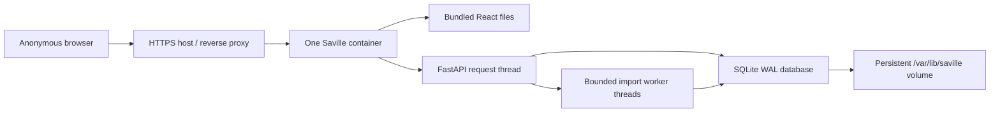

# Hosted deployment

Phase 3 packages Saville Music Persona Web as one production container. The container serves the compiled React application and `/api` from the same origin, runs exactly one FastAPI process, and stores SQLite state under `/var/lib/saville`.

## Why one container and one process

The current import coordinators use persistent SQLite job records plus in-process worker threads. Multiple Uvicorn workers or multiple container replicas could accept two jobs for the same session and would not share their in-memory capacity controls. Phase 3 therefore uses this topology:



This is intentionally small and appropriate for friend-group testing. Do not enable platform autoscaling, multiple replicas, Gunicorn workers, or `WEB_CONCURRENCY` above `1`. A later distributed-worker architecture would require a shared queue and a database designed for multiple application instances.

## Build and test locally

Docker Desktop or another Docker-compatible runtime is required.

```powershell
docker compose up --build
```

Open `http://localhost:8000`. The Compose profile sets `SMP_SESSION_COOKIE_SECURE=false` because local HTTP cannot set a Secure cookie. It uses the named volume `saville-data`, so restarting the container does not discard active sessions or the reusable metadata cache.

Stop it with:

```powershell
docker compose down
```

Do not add `--volumes` unless you intentionally want to erase the hosted test database.

## Deploy the container

Any host that accepts an OCI/Docker image can run this edition. The GitHub Actions workflow verifies the backend, frontend, and production container on every push. A successful `main` build publishes:

```text
ghcr.io/aidanchan0623/saville-music-persona-web:latest
```

If a hosting provider cannot pull the image, make the GHCR package public in its package settings or configure that provider with a GitHub package-read token. A public source repository does not guarantee that every newly created container package is public.

Configure the host as follows:

- Container port: `8000`
- Health/readiness path: `/api/ready`
- Replica count: exactly `1`
- Persistent mount: `/var/lib/saville`
- Public URL: HTTPS
- Start command: use the image default command

Minimum environment:

```text
SMP_DEPLOYMENT_MODE=anonymous
SMP_SERVE_FRONTEND=true
SMP_DATA_DIR=/var/lib/saville
SMP_SESSION_COOKIE_SECURE=true
SMP_SESSION_COOKIE_SAMESITE=lax
WEB_CONCURRENCY=1
```

Because the frontend and API are served from one domain, `SameSite=lax` is sufficient and no cross-site API URL is needed. Keep `VITE_API_BASE_URL=/api`, which is already baked into the production image.

Useful resource settings:

```text
SMP_SESSION_TTL_HOURS=24
SMP_SESSION_CLEANUP_INTERVAL_SECONDS=300
SMP_ANONYMOUS_MAX_UPLOAD_BYTES=104857600
SMP_ANONYMOUS_MAX_EVENTS=250000
SMP_ANONYMOUS_UPLOADS_PER_HOUR=4
SMP_ANONYMOUS_MAX_CONCURRENT_IMPORTS=2
SMP_ACCESS_LOG=false
```

## Free-hosting trade-off

The container can run on a free container service if it supports the image and at least 100 MB request bodies. Many free services provide only an ephemeral filesystem. Saville will still work there, but a restart may erase active sessions and the shared metadata cache. That failure mode is privacy-safe, but it is not durable.

For durable friend testing, use either a host with a persistent volume mounted at `/var/lib/saville` or a small VM running `docker compose`. The code does not require a paid database, object store, login provider, or LLM during Phase 3.

## Storage behavior

- The SQLite database contains active anonymous sessions and shared public music metadata.
- SQLite runs in WAL mode with a 30-second busy timeout for concurrent request/import threads.
- Uploaded archives are processed from temporary storage and deleted after the job finishes.
- Expired sessions and their derived listening-event rows are deleted automatically.
- A visitor can delete their session immediately from Settings.
- Do not copy the live database off the server as a casual analytics export; it may contain sessions that have not expired yet.

## Privacy and logs

Saville does not add product analytics, user accounts, email addresses, or a developer-facing listening-history dashboard. Uvicorn access logs are disabled by default. The hosting provider or HTTPS proxy may still retain ordinary infrastructure logs such as IP address, user agent, request time, and bandwidth. Configure that provider's retention separately and disclose it before a broader public test.

## Operational checks

- `/api/health` is a lightweight liveness response.
- `/api/ready` verifies the SQLite database is writable and the bundled frontend exists.
- The container health check calls `/api/ready` every 30 seconds.
- Interrupted imports are marked failed at startup; the previous completed profile remains available and the visitor can retry.
- If readiness fails, first check that `/var/lib/saville` exists and is writable by UID `10001`.

## What Phase 3 does not include

Phase 3 does not add a hosted LLM, external metadata provider credentials, multi-replica scaling, or production analytics/alerting. Those remain Phase 4 and Phase 5 work.
